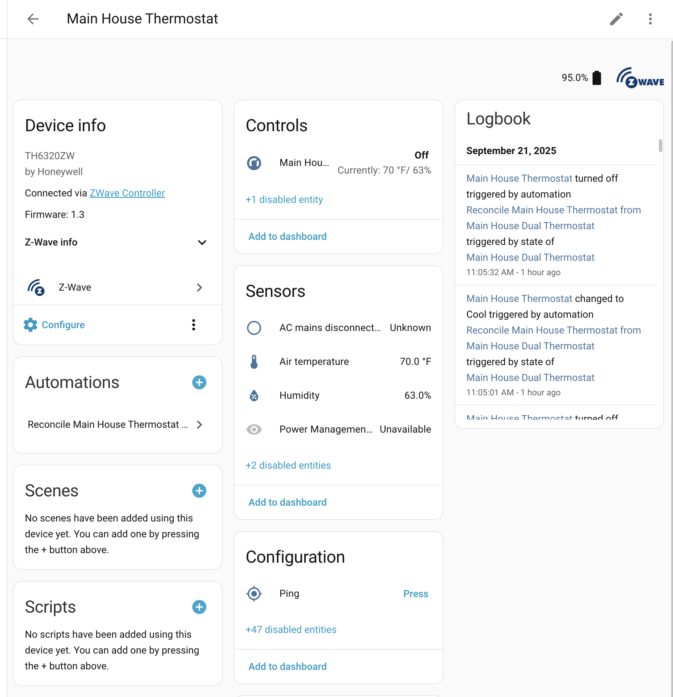
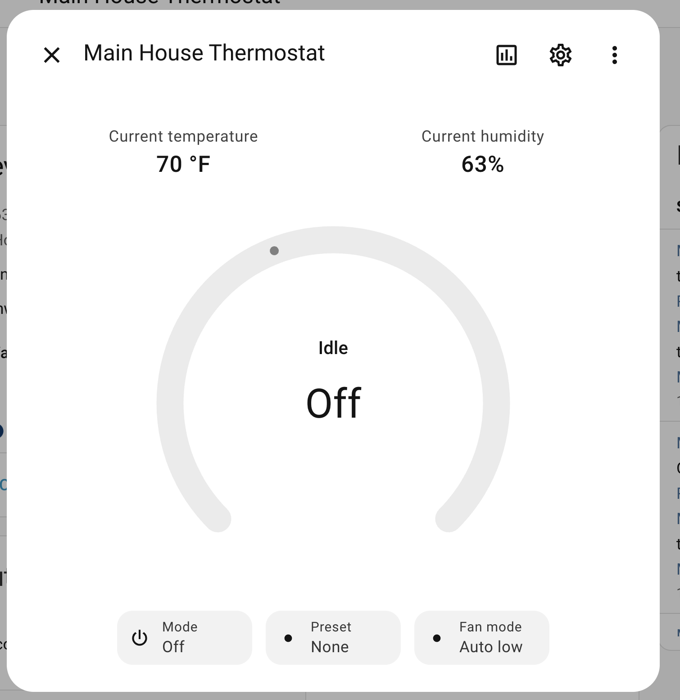
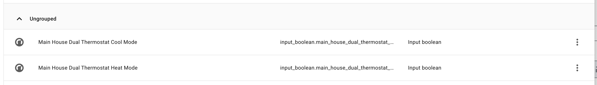
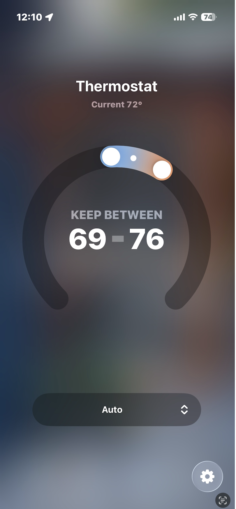
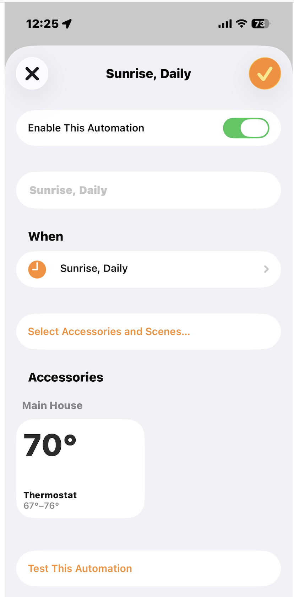

# Single-Mode Thermostat Wrapper

**Use Case**: Create Nest-like "Keep Between" functionality on top of a single-mode thermostat (one that only supports either heat OR cool at a time, not both simultaneously).

**Source**: Based on [GitHub Issue #432](https://github.com/swingerman/ha-dual-smart-thermostat/issues/432) by [@alexklibisz](https://github.com/alexklibisz)

## Overview

Many thermostats (like Honeywell T6 ZWave) only support a single mode at a time - they can heat OR cool, but not maintain a temperature range. This example shows how to use the Dual Smart Thermostat as a "virtual wrapper" to add heat/cool mode functionality.

### What This Achieves

- **Keep Between Temperature Range**: Set a low and high temperature, system automatically switches modes
- **Apple Home/HomeKit Integration**: Shows up as a proper dual-mode thermostat
- **Better User Experience**: Control your single-mode thermostat like a Nest or modern smart thermostat

#### Starting Point: Single-Mode Thermostat



*Your original single-mode thermostat - can only heat OR cool, not both*



*Limited controls - notice you can only select one mode at a time*

### How It Works

```
┌─────────────────────────────────────┐
│  Dual Smart Thermostat (Virtual)    │
│  - Shows heat_cool mode             │
│  - Sets target_temp_low & high      │
│  - Uses dummy switches              │
└──────────────┬──────────────────────┘
               │
               │ Automation reconciles
               │ state every 5 minutes
               ▼
┌─────────────────────────────────────┐
│  Real Single-Mode Thermostat        │
│  - Actually controls HVAC           │
│  - Only supports heat OR cool       │
└─────────────────────────────────────┘
```

## Prerequisites

- A thermostat that only supports single mode (heat OR cool)
- Home Assistant with this integration installed
- Basic understanding of helpers and automations

## Setup Instructions

### Step 1: Create Input Boolean Helpers

Create two input boolean helpers that act as dummy switches for the dual thermostat.

**Via UI**: Settings → Devices & Services → Helpers → Create Helper → Toggle

Create these two helpers:
- `input_boolean.dual_thermostat_heat_mode`
- `input_boolean.dual_thermostat_cool_mode`

**Via YAML**: Add to your `configuration.yaml`:
```yaml
input_boolean:
  dual_thermostat_heat_mode:
    name: "Dual Thermostat Heat Mode"
    icon: mdi:fire
  dual_thermostat_cool_mode:
    name: "Dual Thermostat Cool Mode"
    icon: mdi:snowflake
```



*Example of the input boolean helpers - these act as dummy switches*

### Step 2: Create Input Number Helpers (for automation logic)

Create two input number helpers to track target temperatures:

**Via UI**: Settings → Devices & Services → Helpers → Create Helper → Number

Create these two helpers:
- `input_number.dual_thermostat_minimum_temperature` (range: 60-80°F or 15-27°C)
- `input_number.dual_thermostat_maximum_temperature` (range: 60-80°F or 15-27°C)

**Via YAML**: See [helpers.yaml](helpers.yaml)


*Input number helpers for tracking min/max temperatures*

### Step 3: Configure Dual Smart Thermostat

Add to your `configuration.yaml`:

```yaml
climate:
  - platform: dual_smart_thermostat
    name: "Dual Thermostat"
    heater: input_boolean.dual_thermostat_heat_mode
    cooler: input_boolean.dual_thermostat_cool_mode
    target_sensor: sensor.your_thermostat_temperature  # Your real thermostat's temp sensor
    heat_cool_mode: true
    initial_hvac_mode: "heat_cool"
```

**Important**: Replace `sensor.your_thermostat_temperature` with your actual thermostat's temperature sensor entity ID.

See [configuration.yaml](configuration.yaml) for complete example.

### Step 4: Create Reconciliation Automation

This automation translates the dual thermostat's state to your real thermostat every 5 minutes or when the dual thermostat changes.

**Via UI**: Settings → Automations & Scenes → Create Automation → Start with empty automation

Then switch to YAML mode and paste the content from [automation.yaml](automation.yaml).

**Important**:
- Replace `climate.your_real_thermostat` with your actual thermostat entity ID
- Replace device IDs with your actual device ID (found in Device Info)
- Adjust temperature units if needed (Fahrenheit vs Celsius)

### Step 5: Test the Setup

1. **Restart Home Assistant** to load the new configuration
2. **Set the dual thermostat** to heat_cool mode
3. **Set target temperatures**: Low: 68°F, High: 72°F
4. **Watch the automation run** and verify your real thermostat responds correctly
5. **Test edge cases**:
   - Temperature below minimum → Should heat
   - Temperature above maximum → Should cool
   - Temperature in range → Should turn off

### Step 6: Expose via HomeKit (Optional)

If you want this to show up in Apple Home:

1. Go to Settings → Devices & Services → HomeKit Bridge
2. Add the `climate.dual_thermostat` entity
3. Configure and pair with your iOS device

## Files in This Example

- [README.md](README.md) - This file, full documentation
- [configuration.yaml](configuration.yaml) - Dual thermostat configuration
- [helpers.yaml](helpers.yaml) - Input boolean and number helper definitions
- [automation.yaml](automation.yaml) - Reconciliation automation logic

## How the Automation Works

The automation has several conditions that handle different scenarios:

1. **Off Mode**: If dual thermostat is off → Turn off real thermostat
2. **Cool Mode**: If dual thermostat is cooling → Set real thermostat to cool
3. **Heat Mode**: If dual thermostat is heating → Set real thermostat to heat
4. **Heat/Cool - In Range**: If temp is between min/max → Turn off real thermostat
5. **Heat/Cool - Too Cold**: If temp < minimum → Heat to midpoint temperature
6. **Heat/Cool - Too Hot**: If temp > maximum → Cool to midpoint temperature

### Why Use Midpoint Temperature?

When switching from heat_cool mode to a single mode (heat or cool), single-mode thermostats need a target temperature. The automation uses the average of your low and high targets as a reasonable setpoint.

Example: If your range is 68-72°F:
- When heating: Target is 70°F (average)
- When cooling: Target is 70°F (average)

## Troubleshooting

### Dual Thermostat Not Appearing

- Verify configuration.yaml syntax
- Check logs: Settings → System → Logs
- Restart Home Assistant

### Real Thermostat Not Responding

- Check automation is enabled
- Verify entity IDs match your devices
- Look for automation errors in Traces: Settings → Automations → [Your Automation] → Traces

### Temperature Oscillation

If the system switches between heating and cooling too frequently:
- Increase the temperature range (make min lower, max higher)
- Add hysteresis to the automation conditions
- Increase the automation trigger time (from 5 minutes to 10 minutes)

### Automation Runs But Nothing Happens

- Verify device IDs are correct (check in Device Info)
- Check if your real thermostat entity is available
- Enable automation traces to see which conditions are being met

## Customization Ideas

### Adjust Timing

Change the automation trigger from 5 minutes to something else:
```yaml
triggers:
  - trigger: time_pattern
    minutes: /10  # Every 10 minutes instead of 5
```

### Add Hysteresis

Prevent rapid switching by adding a temperature buffer:
```yaml
- condition: numeric_state
  entity_id: climate.your_real_thermostat
  attribute: current_temperature
  above: input_number.dual_thermostat_maximum_temperature + 1  # Add 1 degree buffer
```

### Notifications

Get notified when modes switch:
```yaml
- action: notify.mobile_app_your_phone
  data:
    message: "Thermostat switched to {{ states('climate.dual_thermostat') }} mode"
```

## Final Result

Once everything is set up, you'll have a fully functional dual-mode thermostat with "Keep Between" functionality!

### Apple Home Integration



*The dual thermostat in Apple Home - notice the temperature range slider (Keep Between)*



*Setting the temperature range - just like a Nest thermostat!*

The integration works seamlessly with Apple Home (via HomeKit Bridge), giving you:
- Temperature range control (low and high)
- Mode switching (heat, cool, heat/cool, off)
- Current temperature display
- Full automation support

**This is exactly what you can achieve with this setup!**

## Limitations

- **5-Minute Delay**: Changes take up to 5 minutes to propagate (or whenever state changes)
- **Additional Complexity**: More components to maintain and troubleshoot
- **Not Real Heat/Cool Mode**: Your HVAC can't actually heat and cool simultaneously
- **Helper Entities**: Requires extra entities that show up in your entity list

## Alternative Approaches

### Option 1: Use Blueprint (Coming Soon)

We're working on an automation blueprint that makes this setup much easier. Stay tuned!

### Option 2: Native Integration (Future Enhancement)

In the future, this integration might support "controlled thermostat" mode natively, eliminating the need for automations.

**Related Discussion**: See [Issue #281 - Proxy "Dumb" Climate entity](https://github.com/swingerman/ha-dual-smart-thermostat/issues/281) for discussion about native climate entity control support.

## Credits

- **Original Author**: [@alexklibisz](https://github.com/alexklibisz)
- **Original Issue**: [#432](https://github.com/swingerman/ha-dual-smart-thermostat/issues/432)
- **Screenshots**: Provided by [@alexklibisz](https://github.com/alexklibisz) from the original issue
- **Hardware tested with**: Honeywell T6 ZWave Thermostat

## Questions or Improvements?

If you have questions, improvements, or issues with this example, please:
- Comment on [Issue #432](https://github.com/swingerman/ha-dual-smart-thermostat/issues/432)
- Open a new issue referencing this example
- Submit a pull request with improvements

---

**Need help with other use cases?** Check out the [examples directory](../) for more configurations!
